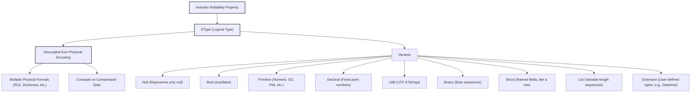

# Chapter 1: DType (`DType`)

Welcome to the Vortex project documentation. This first chapter introduces a foundational concept in Vortex: the `DType`. The `DType` is central to how Vortex represents and understands data, forming the bedrock upon which arrays and operations are built.

## The Essence of `DType`: Logical Data Representation

In any data processing system, a fundamental requirement is to define the type of data being handled. Is it a series of integers, strings of text, or more complex structures? Vortex addresses this through the `DType` abstraction, which represents the **logical data type** of elements within an array.

The critical insight behind Vortex's `DType` is its **decoupling from the physical encoding** of the data. This means that a `DType` like `Int32` specifies that an array contains 32-bit signed integers logically, but it makes no assertion about how these integers are stored in memory. For instance, a list of `Int32` values could be stored as a contiguous block of raw numbers, or it might be run-length encoded (RLE) if it contains many repeated values, or even dictionary encoded if the cardinality of unique values is low.

This separation is a cornerstone of Vortex's architecture, enabling several powerful capabilities:
1.  **Flexibility in Storage**: The same logical data can be materialized in various physical formats, allowing the system to choose the most efficient encoding for a given dataset and workload.
2.  **Performance Optimization**: Operations can be performed directly on compressed or otherwise non-canonically encoded data, avoiding costly decompression and re-encoding steps.
3.  **Extensibility**: New logical types can be defined without requiring new physical storage strategies for each, and new encodings can be introduced for existing logical types.

Furthermore, the `DType` also intrinsically handles **nullability**, specifying whether elements in an array can take on a `null` value in addition to their domain-specific values.

The primary definition of `DType` resides in the `vortex-dtype` crate, as indicated in the project's architecture. This crate lays the groundwork for the Vortex type system.

```rust
// Relevant excerpt from vortex-dtype/src/dtype.rs
// Defines the DType enum and its variants.
#[derive(Debug, Clone, PartialEq, Eq, Hash)]
#[cfg_attr(feature = "serde", derive(serde::Serialize, serde::Deserialize))]
pub enum DType {
    Null,
    Bool(Nullability),
    Primitive(PType, Nullability),
    Decimal(DecimalDType, Nullability),
    Utf8(Nullability),
    Binary(Nullability),
    Struct(Arc<StructDType>, Nullability),
    List(Arc<DType>, Nullability),
    Extension(Arc<ExtDType>),
}
```
This Rust `enum` declaration lists the various kinds of logical types that Vortex can represent. We will explore each of these in detail. Notice the use of `Arc` for `Struct`, `List`, and `Extension` types; this is to manage potentially large and recursive type definitions efficiently, avoiding deep copies.

## Core Logical Types in Vortex

Vortex provides a comprehensive set of built-in logical types. Each of these can be nullable or non-nullable.



Let's examine these variants:

### 1. `Null`
The `DType::Null` represents a type that can only contain `null` values. This is useful for columns or arrays that are known to be entirely null. It inherently implies nullability.

```rust
// Example: Creating a Null DType
let null_type = DType::Null;
println!("Created DType: {}", null_type);
```
Output:
```
Created DType: null
```

### 2. `Bool`
`DType::Bool(Nullability)` represents logical boolean values (`true` or `false`). The `Nullability` parameter specifies whether `null` is also a permitted value.

```rust
// From vortex-dtype/src/nullability.rs
#[derive(Debug, Copy, Clone, PartialEq, Eq, Hash)]
pub enum Nullability {
    NonNullable,
    Nullable,
}

// Example: Creating Bool DTypes
let non_nullable_bool = DType::Bool(Nullability::NonNullable);
let nullable_bool = DType::Bool(Nullability::Nullable);
println!("Non-nullable bool: {}", non_nullable_bool);
println!("Nullable bool: {}", nullable_bool);
```
Output:
```
Non-nullable bool: bool!
Nullable bool: bool?
```
The `Display` implementation for `DType` uses `!` for non-nullable and `?` for nullable, providing a concise string representation.

### 3. `Primitive`
`DType::Primitive(PType, Nullability)` covers fixed-width numeric types. `PType` (Primitive Type) is an enum that specifies the exact kind of primitive.

```rust
// From vortex-dtype/src/ptype.rs (simplified)
#[derive(Debug, Copy, Clone, PartialEq, Eq, Hash)]
pub enum PType {
    U8, U16, U32, U64, // Unsigned integers
    I8, I16, I32, I64, // Signed integers
    F16, F32, F64,     // Floating point numbers
}

// Example: Creating Primitive DTypes
let int32_type = DType::Primitive(PType::I32, Nullability::NonNullable);
let nullable_f64_type = DType::Primitive(PType::F64, Nullability::Nullable);
println!("Int32 type: {}", int32_type);
println!("Nullable F64 type: {}", nullable_f64_type);
```
Output:
```
Int32 type: i32!
Nullable F64 type: f64?
```
Primitive types are fundamental for numerical computations and form the basis for many other types and encodings.

### 4. `Decimal`
`DType::Decimal(DecimalDType, Nullability)` represents real numbers with fixed exact precision and scale. This is crucial for financial calculations where floating-point inaccuracies are unacceptable.

```rust
// From vortex-dtype/src/decimal.rs (simplified struct definition)
#[derive(Debug, Copy, Clone, PartialEq, Eq, Hash)]
pub struct DecimalDType {
    precision: u8, // total number of digits
    scale: i8,     // number of digits to the right of the decimal point
}

// Example: Creating a Decimal DType
let price_type = DType::Decimal(
    DecimalDType::new(10, 2), // e.g., precision 10, scale 2 (like 12345678.90)
    Nullability::Nullable
);
println!("Price type: {}", price_type);
```
Output:
```
Price type: decimal(10, 2)?
```

### 5. `Utf8`
`DType::Utf8(Nullability)` represents variable-length strings encoded in UTF-8.

```rust
// Example: Creating a Utf8 DType
let string_type = DType::Utf8(Nullability::NonNullable);
println!("String type: {}", string_type);
```
Output:
```
String type: utf8!
```

### 6. `Binary`
`DType::Binary(Nullability)` represents variable-length sequences of arbitrary bytes. This is suitable for data like images, serialized objects, or any opaque binary data.

```rust
// Example: Creating a Binary DType
let binary_data_type = DType::Binary(Nullability::Nullable);
println!("Binary data type: {}", binary_data_type);
```
Output:
```
Binary data type: binary?
```

### 7. `Struct`
`DType::Struct(Arc<StructDType>, Nullability)` represents an ordered collection of named fields, where each field has its own `DType`. This is Vortex's way of representing complex objects or, significantly, entire rows of a table. Vortex does not have a separate "schema" concept; instead, a `StructDType` serves this purpose.

```rust
// From vortex-dtype/src/dtype.rs and vortex-dtype/src/struct_.rs (conceptual)
pub type FieldName = Arc<str>;
pub type FieldNames = Arc<[FieldName]>;

// Simplified StructDType structure for illustration
// pub struct StructDType { names: FieldNames, fields: Vec<DType> }

// Example: Creating a Struct DType
use std::sync::Arc;
use vortex_dtype::{DType, FieldName, Nullability, PType, StructDType};

let user_type = DType::Struct(
    Arc::new(StructDType::new(
        vec![FieldName::from("id"), FieldName::from("name")].into(),
        vec![
            DType::Primitive(PType::I64, Nullability::NonNullable),
            DType::Utf8(Nullability::Nullable),
        ],
    )),
    Nullability::NonNullable,
);
println!("User type: {}", user_type);
```
Output:
```
User type: {id=i64!, name=utf8?}!
```
This example defines a struct with an `id` field (non-nullable 64-bit integer) and a `name` field (nullable UTF-8 string). The entire struct itself is non-nullable.

### 8. `List`
`DType::List(Arc<DType>, Nullability)` represents a variable-length sequence of elements, all of which share the same element `DType`. The `Arc<DType>` points to the type of the elements within the list.

```rust
// Example: Creating a List DType (list of nullable Int32s)
use std::sync::Arc;
use vortex_dtype::{DType, Nullability, PType};

let list_of_ints_type = DType::List(
    Arc::new(DType::Primitive(PType::I32, Nullability::Nullable)),
    Nullability::NonNullable,
);
println!("List of ints type: {}", list_of_ints_type);
```
Output:
```
List of ints type: list(i32?)!
```
This defines a non-nullable list, where each element in the list is a nullable 32-bit integer.

### 9. `Extension`
`DType::Extension(Arc<ExtDType>)` provides a mechanism for user-defined logical types. An extension type consists of an `id` (a string uniquely identifying the extension), a `storage_dtype` (an existing `DType` that defines how the data is physically represented at a base level), and optional `metadata` (bytes that can further specify the type). Nullability for an extension type is derived from its `storage_dtype`.

This is particularly useful for semantic types like `Datetime`, `Date`, or `Timestamp`, which can be stored as primitive types (e.g., `I64` for nanoseconds since epoch) but have specific semantic meaning and associated operations.

```rust
// From vortex-dtype/src/extension.rs (conceptual)
// pub struct ExtDType { id: ExtID, storage_dtype: DType, metadata: Option<Arc<[u8]>> }
// pub type ExtID = Arc<str>;

// Example: Creating an Extension DType (conceptual Datetime)
use std::sync::Arc;
use vortex_dtype::{DType, ExtDType, ExtID, Nullability, PType};

let datetime_type = DType::Extension(Arc::new(ExtDType::new(
    ExtID::from("vortex.datetime_ns"), // Unique ID for this extension type
    DType::Primitive(PType::I64, Nullability::Nullable), // Stored as nullable I64
    Some(Arc::from(b"UTC" as &[u8])), // Optional metadata (e.g., timezone)
)));
println!("Datetime type: {}", datetime_type);
```
Output:
```
Datetime type: ext(vortex.datetime_ns, i64, b"UTC")?
```
Here, `vortex.datetime_ns` logically represents nanoseconds since epoch. It's stored as an `I64`. The `?` at the end indicates that the overall extension type (derived from its storage type `i64?`) is nullable.

## Nullability in `DType`

As seen in the examples, nullability is an integral part of most `DType` variants. The `Nullability` enum (`Nullable` or `NonNullable`) is explicitly associated with types like `Bool`, `Primitive`, `Utf8`, `Binary`, `Struct`, and `List`. For `DType::Null`, nullability is inherent. For `DType::Extension`, the nullability is determined by its underlying `storage_dtype`.

The `DType` struct provides methods to work with nullability:
```rust
// From vortex-dtype/src/dtype.rs
impl DType {
    pub fn is_nullable(&self) -> bool {
        // ... implementation ...
        match self {
            Null => true,
            Extension(ext_dtype) => ext_dtype.storage_dtype().is_nullable(),
            Bool(n)
            | Primitive(_, n)
            | Decimal(_, n)
            | Utf8(n)
            | Binary(n)
            | Struct(_, n)
            | List(_, n) => matches!(n, Nullability::Nullable),
        }
    }

    pub fn as_nonnullable(&self) -> Self {
        self.with_nullability(Nullability::NonNullable)
    }

    pub fn as_nullable(&self) -> Self {
        self.with_nullability(Nullability::Nullable)
    }

    // ... other methods like with_nullability, union_nullability ...
}
```
These methods allow for querying and modifying the nullability aspect of a `DType` instance without changing its fundamental kind. For example:
```rust
use vortex_dtype::{DType, Nullability, PType};

let int_type = DType::Primitive(PType::I32, Nullability::NonNullable);
println!("Is nullable: {}", int_type.is_nullable()); // false

let nullable_int_type = int_type.as_nullable();
println!("New type: {}, Is nullable: {}", nullable_int_type, nullable_int_type.is_nullable()); // i32?, true
```

## Working with `DType` Instances

Beyond creation and nullability, `DType` offers various utility methods for inspection and comparison.

### Type Checking
You can check the kind of a `DType` using methods like `is_primitive()`, `is_struct()`, `is_int()`, `is_float()`, etc.
```rust
use vortex_dtype::{DType, Nullability, PType};

let dtype1 = DType::Primitive(PType::U32, Nullability::NonNullable);
let dtype2 = DType::Utf8(Nullability::Nullable);

println!("dtype1 is primitive: {}", dtype1.is_primitive()); // true
println!("dtype1 is int: {}", dtype1.is_int());             // true
println!("dtype1 is float: {}", dtype1.is_float());           // false
println!("dtype2 is utf8: {}", dtype2.is_utf8());             // true
```

### Accessing Inner Properties
For composite types, you can access their constituent parts.
```rust
use std::sync::Arc;
use vortex_dtype::{DType, FieldName, Nullability, PType, StructDType};

// For Primitive types:
let ptype = DType::Primitive(PType::I32, Nullability::NonNullable).to_ptype();
println!("Primitive type: {:?}", ptype); // I32

// For Struct types:
let struct_dtype_instance = Arc::new(StructDType::new(
    vec![FieldName::from("value")].into(),
    vec![DType::Primitive(PType::F32, Nullability::NonNullable)],
));
let complex_type = DType::Struct(struct_dtype_instance.clone(), Nullability::NonNullable);
if let Some(s_arc) = complex_type.as_struct() {
    let struct_def: &StructDType = s_arc; // Access to the Arc<StructDType>
    println!("Struct fields: {:?}", struct_def.names());
}

// For List types:
let list_type = DType::List(Arc::new(DType::Bool(Nullability::NonNullable)), Nullability::Nullable);
if let Some(element_dtype) = list_type.as_list_element() {
    println!("List element type: {}", element_dtype); // bool!
}
```

### Equality Ignoring Nullability
Sometimes it's useful to compare if two `DType`s are fundamentally the same kind, irrespective of their nullability.
```rust
use vortex_dtype::{DType, Nullability, PType};

let type_a = DType::Primitive(PType::I64, Nullability::NonNullable);
let type_b = DType::Primitive(PType::I64, Nullability::Nullable);
let type_c = DType::Primitive(PType::F64, Nullability::Nullable);

println!("A == B (strict): {}", type_a == type_b); // false
println!("A eq_ignore_nullability B: {}", type_a.eq_ignore_nullability(&type_b)); // true
println!("A eq_ignore_nullability C: {}", type_a.eq_ignore_nullability(&type_c)); // false
```

## Memory Layout and Efficiency

The `DType` enum in Rust is designed to be efficient. For target architectures other than `wasm32`, its size is asserted to be 16 bytes.
```rust
// From vortex-dtype/src/dtype.rs
use static_assertions::const_assert_eq;
// ...
#[cfg(not(target_arch = "wasm32"))]
const_assert_eq!(size_of::<DType>(), 16);

#[cfg(target_arch = "wasm32")]
const_assert_eq!(size_of::<DType>(), 8);
```
This compile-time assertion helps ensure that changes to the `DType` definition do not inadvertently increase its size, which is important as `DType` objects can be numerous in complex schemas or frequently passed around. The use of `Arc` for nested types (`Struct`, `List`, `Extension`) contributes to this by storing the more complex, variable-sized parts of the type definition on the heap and only holding a pointer and reference count within the `DType` enum itself.

## Serialization of DTypes

For persistent storage (e.g., in file footers) or network transmission, `DType` instances need to be serializable. Vortex primarily uses Protocol Buffers (protobuf) for this purpose. The `vortex-proto` crate defines the protobuf messages corresponding to `DType` and its variants.

A simplified view of the `DType` protobuf message might look like this:
```protobuf
// Conceptual snippet from vortex-proto/src/generated/vortex.dtype.rs
// This is a .proto definition, not Rust code.

message DType {
  oneof dtype_type {
    Null null_type = 1;
    Bool bool_type = 2;
    Primitive primitive_type = 3;
    Decimal decimal_type = 4;
    Utf8 utf8_type = 5;
    Binary binary_type = 6;
    Struct struct_type = 7;
    List list_type = 8;       // Note: List and Extension are boxed in Rust,
    Extension extension_type = 9; // reflected by message types in proto.
  }
}

message Primitive {
  PType ptype = 1; // PType would be an enum in protobuf
  bool nullable = 2;
}

message Struct {
  repeated string names = 1;
  repeated DType dtypes = 2;
  bool nullable = 3;
}
// ... and so on for other types.
```
The `oneof` construct in protobuf allows the `DType` message to hold exactly one of the specific type variants, mirroring the Rust `enum` structure. The `vortex-dtype/src/lib.rs` also points to FlatBuffers as another serialization mechanism, which can be particularly efficient for "zero-copy" access to serialized type information. This relates to the "Owned vs Viewed" DTypes mentioned in `docs/concepts/dtypes.md`, where viewed DTypes could be lazily deserialized from a FlatBuffer, enhancing performance for very wide or deeply nested types by avoiding full in-memory materialization.

## Comparison with Apache Arrow DTypes

For users familiar with Apache Arrow, it's helpful to highlight some key differences in how Vortex handles data types:

1.  **Nullability**: In Arrow, nullability is typically a property of a `Field` (which combines a name, type, and nullability) rather than the data type itself. In Vortex, `DType` directly incorporates `Nullability`.
2.  **String Types**: Arrow has distinct types like `DataType::Utf8` and `DataType::LargeUtf8` (and `Binary`/`LargeBinary`) which differ in their offset sizes. Vortex uses a single `DType::Utf8` (and `DType::Binary`), with the choice of offset size being an encoding/layout detail rather than a logical type distinction.
3.  **Encoded Data**: Arrow sometimes represents encoded data with distinct data types (e.g., `DataType::Dictionary`). In Vortex, encodings are a separate concept from the logical `DType`. An array of `DType::Int32` might be dictionary-encoded, but its logical type remains `Int32`. This is a fundamental distinction.
4.  **Date and Time Types**: Arrow defines date and time types as first-class data types. Vortex represents these as `DType::Extension`, composing them from primitive storage types (e.g., `I64` for timestamps) and metadata.
5.  **Schema Representation**: Arrow uses a `Schema` object to describe the structure of a `RecordBatch` or `Table`. Vortex does not have a distinct `Schema` object; instead, a `DType::Struct` is used to represent columnar data. This means a single integer array is as valid a top-level Vortex structure as a multi-column table represented by a `Struct`.

These differences reflect Vortex's design philosophy, particularly its emphasis on the strict separation of logical type from physical representation and encoding.

## Conclusion

The `DType` is a pivotal abstraction in Vortex, defining the "what" of the data (its logical nature and domain of values) while intentionally deferring the "how" (its physical storage and encoding) to other parts of the system. This chapter has detailed its structure, the various logical types it can represent, its handling of nullability, and its role in the broader Vortex ecosystem. Understanding `DType` is crucial for grasping how Vortex manages data and enables its advanced features like computation on compressed data.

With the logical type of data elements now defined, the next step is to understand how individual data values of these types are represented. This leads us to the concept of a [Scalar (`Scalar`)](02_scalar___scalar___.md).

---

Generated by [AI Codebase Knowledge Builder](https://github.com/The-Pocket/Tutorial-Codebase-Knowledge)
