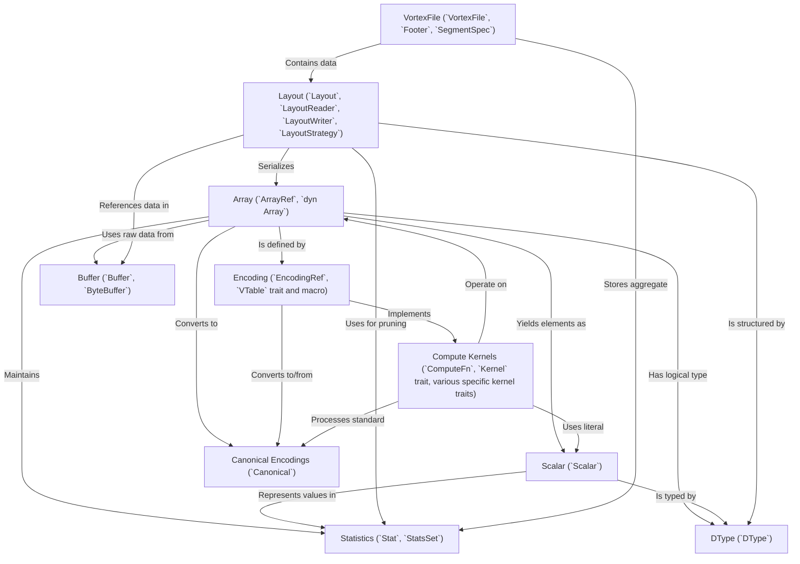

# Tutorial: vortex

Vortex is a project for **efficient columnar data representation and processing**.
It uses *Arrays* as the primary in-memory data structure, which can have various physical *Encodings* (like compression or dictionary-encoding) while maintaining a consistent logical *DType*.
Vortex supports *Compute Kernels* that can operate directly on encoded data, potentially avoiding full decompression.
It provides a *VortexFile* format for on-disk storage, leveraging *Layouts* and *Statistics* for optimization and efficient data access.
The system aims for zero-copy interoperability with Apache Arrow through *Canonical Encodings*.

**Source Repository:** [None](None)

## Chapters

1. [DType (`DType`)
](01_dtype___dtype___.md)
2. [Scalar (`Scalar`)
](02_scalar___scalar___.md)
3. [Array (`ArrayRef`, `dyn Array`)
](03_array___arrayref____dyn_array___.md)
4. [Encoding (`EncodingRef`, `VTable` trait and macro)
](04_encoding___encodingref____vtable__trait_and_macro__.md)
5. [Compute Kernels (`ComputeFn`, `Kernel` trait, various specific kernel traits)
](05_compute_kernels___computefn____kernel__trait__various_specific_kernel_traits__.md)
6. [Canonical Encodings (`Canonical`)
](06_canonical_encodings___canonical___.md)
7. [Statistics (`Stat`, `StatsSet`)
](07_statistics___stat____statsset___.md)
8. [Buffer (`Buffer`, `ByteBuffer`)
](08_buffer___buffer____bytebuffer___.md)
9. [Layout (`Layout`, `LayoutReader`, `LayoutWriter`, `LayoutStrategy`)
](09_layout___layout____layoutreader____layoutwriter____layoutstrategy___.md)
10. [VortexFile (`VortexFile`, `Footer`, `SegmentSpec`)
](10_vortexfile___vortexfile____footer____segmentspec___.md)

---

Generated by [AI Codebase Knowledge Builder](https://github.com/The-Pocket/Tutorial-Codebase-Knowledge)
